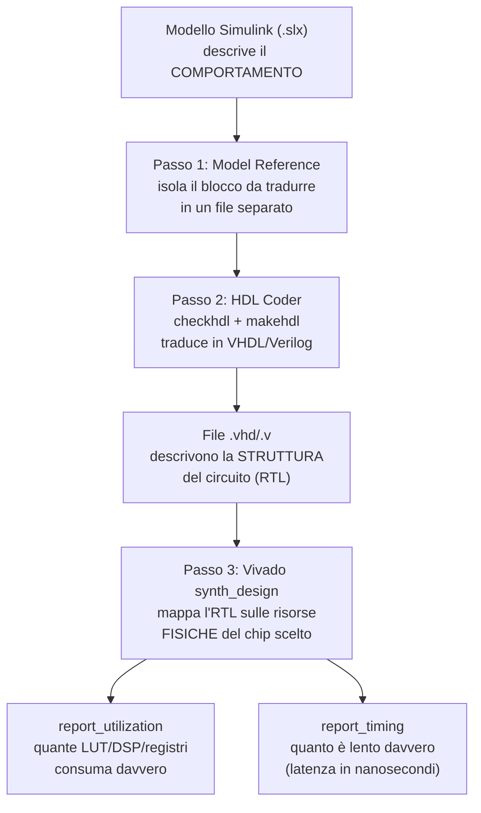

# Guida: dal modello Simulink alla sintesi Vivado reale

Questa cartella spiega, in dettaglio e dal principio, **come si trasforma un pezzo di un modello Simulink/SoC Blockset in un vero circuito sintetizzato**, con numeri reali di risorse hardware (LUT, DSP, registri) e di tempo (latenza), usando Xilinx Vivado. Ogni capitolo spiega prima il concetto in generale (vale per qualsiasi progetto FPGA, non solo questo), poi mostra il comando/risultato specifico usato in questo progetto come **esempio concreto**, chiaramente marcato come tale.

Il percorso descritto **bypassa `socModelBuilder`** (lo strumento "tutto in uno" di SoC Blockset che genera software+bitstream): usa invece gli strumenti sottostanti — HDL Coder e Vivado — direttamente. È un metodo più lento da impostare la prima volta, ma più trasparente, più controllabile, e non dipende dal validatore interno di SoC Builder (per cui vedi [`../socbuilder_notes.md`](../socbuilder_notes.md)).

## Perché serve questo percorso, in due frasi

Un modello Simulink descrive un **comportamento** (cosa deve calcolare un blocco, con che segnali). Un chip FPGA è fatto di **risorse fisiche fisse** (un numero finito di LUT, DSP, registri, collegati da fili programmabili). La sintesi è il processo che traduce il primo nel secondo — e finché non lo fai per davvero, non sai quante risorse consumerai né quanto sarà lento. Questa guida mostra come ottenere quei numeri reali.

## Indice

1. [**Model Reference**](01-model-reference.md) — perché un pezzo di modello Simulink a volte deve diventare un file separato "referenziato", non solo un raggruppamento visivo, e come si fa.
2. [**HDL Coder e il concetto di DUT**](02-hdl-coder-dut.md) — cosa fa davvero HDL Coder, perché non tutti i blocchi Simulink sono traducibili in hardware, il problema dei numeri in virgola mobile, e i comandi `checkhdl`/`makehdl`.
3. [**Sintesi Vivado da riga di comando**](03-vivado-sintesi.md) — cos'è la sintesi (distinta dalla simulazione e dal place & route), come si scrive uno script Tcl per Vivado, cosa significa `-mode out_of_context`, e come leggere i report di risorse e di tempo.
4. [**Esempio completo eseguito in questo progetto**](04-esempio-completo.md) — tutti i comandi reali, in ordine, con l'output vero ottenuto.
5. [**Errori comuni e soluzioni**](05-errori-comuni.md) — tabella di riferimento rapido per quando qualcosa va storto.

## Diagramma del flusso completo

Ogni freccia di questo diagramma è un capitolo della guida.
