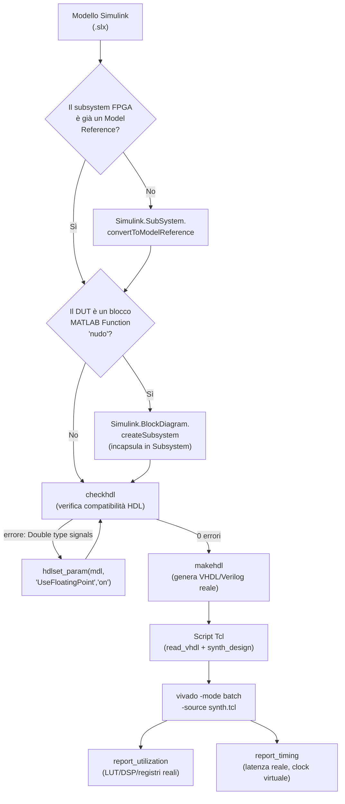

# Come sintetizzare in Vivado un blocco FPGA di un modello SoC Blockset (guida pratica, passo-passo)

Questa guida spiega **come si è arrivati** dal modello Simulink (`Prova_1_socbuilder.slx`) a un vero report di sintesi Vivado (LUT/DSP/timing reali) per il blocco FPGA, **bypassando `socModelBuilder`** — cioè senza dipendere dal validatore "IP Core Generation" di SoC Builder (vedi `docs/socbuilder_notes.md` per perché, a un certo punto, si è scelto di non inseguirlo fino in fondo). È il metodo da riusare quando si vorrà sintetizzare il vero algoritmo MPC.

Non è un tutorial teorico: ogni comando qui è quello realmente eseguito ed è quello che ha prodotto il risultato documentato in [`hdl_findings.md`](hdl_findings.md) (Risultato 3).

## Quando usare questa guida

- Vuoi sapere se un pezzo di logica (un subsystem FPGA, un DUT) **sintetizza davvero** in hardware — quante LUT/DSP/registri consuma, che latenza ha — senza aspettare che l'intera pipeline `socModelBuilder` (build software + hardware + bitstream completo) funzioni.
- Il validatore di SoC Builder si blocca su qualcosa (vedi `docs/socbuilder_notes.md` per le regole note) e vuoi comunque un numero di sintesi reale nel frattempo.
- Stai per sintetizzare l'algoritmo MPC vero e vuoi sapere il flusso da seguire fin dall'inizio.

## Panoramica del flusso



## Prerequisiti

- MATLAB con Simulink, HDL Coder, e il support package Zynq/Xilinx installato.
- Xilinx Vivado installato (in questo progetto: 2022.1, `D:\Xilinx\Vivado\2022.1\bin\vivado.bat`).
- Il modello `.slx` con il subsystem FPGA che vuoi sintetizzare.
- **Percorso di lavoro senza spazi** (es. `D:\NomeCartella\`, non `C:\Users\Nome Cognome\...`) — sia Vivado sia alcuni strumenti MATLAB rompono su path con spazi.

---

## Passo 1 — Il subsystem FPGA deve essere (idealmente) un Model Reference

Non è strettamente necessario per la sola sintesi Vivado diretta (puoi anche lavorare su un Subsystem qualsiasi), ma se il tuo obiettivo finale è anche far funzionare `socModelBuilder`/SoC Builder sullo stesso modello, conviene farlo comunque adesso. Funzione ufficiale (non `Simulink.SubSystem.copyContentsToBlockDiagram`, che copia il contenuto ma non sostituisce il blocco originale):

```matlab
load_system('NomeModello.slx');
Simulink.SubSystem.convertToModelReference( ...
    'NomeModello/NomeSubsystemFPGA', ...   % path del subsystem
    'NomeModelloRiferimento', ...           % nome del NUOVO file .slx referenziato
    'ReplaceSubsystem', true, ...
    'AutoFix', true, ...
    'Force', true);
```

⚠️ **Attenzione al nome scelto**: non usare `'FPGA'` come nome — collide con la funzione toolbox `fpga.m` e Simulink rifiuta la conversione con un errore poco chiaro ("Unable to use 'FPGA' as a new referenced model name... already exists on the path"). Usa qualcosa come `'FPGA_HW'`.

Salva sempre subito dopo:
```matlab
save_system('NomeModello');
save_system('NomeModelloRiferimento', 'D:\PercorsoSenzaSpazi\NomeModelloRiferimento.slx');
```

## Passo 2 — Incapsulare il DUT in un Subsystem (se è un blocco MATLAB Function "nudo")

HDL Coder **non genera codice direttamente da un blocco MATLAB Function a livello root** — dà l'errore:
```
HDL code generation is not directly supported for a MATLAB Function Block.
This object must be enclosed within a subsystem.
```

Fix, usando l'handle numerico del blocco (⚠️ non un path stringa dentro una cell array — dà un errore interno `cell2mat`):
```matlab
h = get_param('NomeModelloRiferimento/MATLAB Function', 'Handle');
Simulink.BlockDiagram.createSubsystem(h, 'Name', 'ComputeCore');
save_system('NomeModelloRiferimento');
```

Questo crea `NomeModelloRiferimento/ComputeCore` come nuovo Subsystem contenente il blocco MATLAB Function — è **questo** il blocco che sintetizzerai (non il MATLAB Function direttamente).

## Passo 3 — `checkhdl`: verifica compatibilità PRIMA di generare codice

```matlab
checkhdl('NomeModelloRiferimento/ComputeCore');
```

**Nota importante**: `checkhdl` non lancia un'eccezione MATLAB se trova errori — scrive un report HTML e stampa `"HDL check ... complete with N errors"` nella console, ma la chiamata "riesce" comunque a livello di script. **Leggi sempre il report** prima di procedere:
```matlab
% il path esatto compare nell'output di checkhdl stesso, es:
% file:///D:/PercorsoSenzaSpazi/hdlsrc/NomeModelloRiferimento/ComputeCore_report.html
```

### Errore comune: "Double type signals"

Se il DUT ha ingressi/uscite di tipo `double` (comune se il canale dati resta bit-esatto fino all'ultimo momento, come nel nostro caso), il report segnala:
```
The model contains "Double" type signals. To generate synthesizable HDL code,
either select the "Use Floating Point" check box or change the "Double" type
signals to fixed-point data type.
```

Se **non vuoi cambiare i tipi di dato del modello** (es. perché sono così per una scelta di design a monte), abilita il supporto floating-point nativo invece di riconvertire tutto in fixed-point:
```matlab
hdlset_param('NomeModelloRiferimento', 'UseFloatingPoint', 'on');
```
⚠️ Il link nel report HTML apre `configset.internal.open(mdl,'UseFloatingPoint')`, ma quel nome NON è un parametro valido per `set_param` diretto sul config set (dà `"Property 'UseFloatingPoint' does not exist"`) — **usa `hdlset_param`**, non `set_param`.

Rilancia `checkhdl` dopo il fix e verifica "0 errors" nel report prima di andare avanti.

## Passo 4 — `makehdl`: genera il codice HDL reale

```matlab
makehdl('NomeModelloRiferimento/ComputeCore', ...
    'TargetDirectory', 'D:\PercorsoSenzaSpazi\hdlsrc_computecore');
```

Produce (per VHDL, default in molte installazioni SoC Blockset):
- `ComputeCore.vhd` — l'entity top-level che sintetizzerai
- `MATLAB_Function.vhd` — il blocco interno
- `ComputeCore_pkg.vhd` — package coi tipi custom
- `ComputeCore_compile.do` — ordine di compilazione (utile per sapere in che ordine dare i file a Vivado: prima il `_pkg`, poi i sotto-moduli, poi il top)

## Passo 5 — Script Tcl per Vivado

Crea un file `synth.tcl` (percorsi assoluti, senza spazi):

```tcl
set part xc7z020clg484-1
read_vhdl -vhdl2008 D:/PercorsoSenzaSpazi/hdlsrc_computecore/NomeModelloRiferimento/ComputeCore_pkg.vhd
read_vhdl -vhdl2008 D:/PercorsoSenzaSpazi/hdlsrc_computecore/NomeModelloRiferimento/MATLAB_Function.vhd
read_vhdl -vhdl2008 D:/PercorsoSenzaSpazi/hdlsrc_computecore/NomeModelloRiferimento/ComputeCore.vhd

synth_design -top ComputeCore -part $part -mode out_of_context

report_utilization -file D:/PercorsoSenzaSpazi/vivado_synth/utilization.txt

# Il DUT e' spesso puramente combinatorio (nessun clock reale nel Verilog/VHDL
# generato) - per ottenere comunque un numero di latenza si crea un clock
# "virtuale", tecnica standard per misurare ritardi combinatori puri:
create_clock -name virt_clk -period 10
set_input_delay -clock virt_clk 0 [all_inputs]
set_output_delay -clock virt_clk 0 [all_outputs]
report_timing -delay_type max -path_type full -max_paths 5 -file D:/PercorsoSenzaSpazi/vivado_synth/timing.txt

write_checkpoint -force D:/PercorsoSenzaSpazi/vivado_synth/post_synth.dcp
```

**Perché `-mode out_of_context`**: senza questo flag, Vivado tratta ogni segnale del design come se dovesse uscire su un pin fisico reale del chip — se il DUT ha bus larghi (decine/centinaia di bit), supera facilmente il numero di pin fisici disponibili nel package (`xc7z020clg484-1` ne ha ~200) e il place fallisce con `"Placer failed"`/`"Bonded IOB 2627/200"`. `out_of_context` dice a Vivado "questo blocco farà parte di un design più grande, non preoccuparti dei pin fisici adesso" — corretto per testare un sotto-blocco isolato. **Limite noto**: con `out_of_context`, l'Implementation completa (place & route) spesso non è ottenibile per blocchi con bus larghi come porte top-level — resta valida la sola sintesi (LUT/DSP/report_utilization). Per un'Implementation completa reale, servono porte strette (vedi `hdl_findings.md`, Risultato 2, dove è stata ottenuta con successo su un blocco a porte strette).

## Passo 6 — Lanciare Vivado in batch

```bash
cd D:/PercorsoSenzaSpazi/vivado_synth
"D:\Xilinx\Vivado\2022.1\bin\vivado.bat" -mode batch -source synth.tcl -log vivado_run.log -journal vivado_run.jou
```

Può richiedere da pochi secondi a qualche minuto a seconda della dimensione del design. Con `-mode batch` (non `-mode tcl`), Vivado esegue lo script e termina da solo.

## Passo 7 — Leggere i risultati

`utilization.txt` — sezione "1. Slice Logic" per LUT/registri, sezione "4. DSP" per i DSP48:
```
| Slice LUTs | 0 | ... | 53200 | 0.00 |
| DSPs       | 0 | ... |   220 | 0.00 |
```

`timing.txt` — un blocco `Slack (MET)`/`Slack (VIOLATED)` per ogni percorso critico riportato, con `Data Path Delay` = il numero di latenza reale che ti interessa. Se `Logic Levels: 0` e il delay è solo "route" (non "logic"), quel percorso è puro instradamento di fili (routing), non un vero calcolo — succede per reshape/riorganizzazione dati, non per moltiplicazioni/somme reali.

---

## Esempio completo reale (eseguito il 28-29/07/2026)

Applicato a `FPGA_HW/ComputeCore` (il subsystem che ricompone lo stream AXI4 in due matrici `matA`/`matB`, senza fare aritmetica):

```
Slice LUTs:  0 / 53200   (0.00%)
Registri:    0 / 106400  (0.00%)
DSP:         0 / 220     (0.00%)
```

Ogni percorso nel timing report (`readFromMem[0][0]→matA[0,0][0]`, `streamEnable→doneOut1`, ecc.): **0 logic levels, 0.973 ns** di puro routing.

Risultato coerente al 100% con la misura già nota per il reshape puro (`hdl_findings.md`, Risultato 1) — conferma che il metodo funziona end-to-end ed è ripetibile.

**Per un esempio con vero calcolo aritmetico** (moltiplicazione fixed-point, 1 DSP48 + ~3.8ns), vedi Risultato 2 in `hdl_findings.md` — stesso identico metodo, applicato prima a un blocco isolato di test con una vera moltiplicazione invece che solo reshape.

---

## Errori comuni — riferimento rapido

| Errore | Causa | Fix |
|---|---|---|
| `HDL code generation is not directly supported for a MATLAB Function Block` | DUT è un MATLAB Function nudo, non in un Subsystem | Passo 2 (`Simulink.BlockDiagram.createSubsystem`) |
| `The model contains "Double" type signals` | Segnali `double` non convertiti | Passo 3 (`hdlset_param(mdl,'UseFloatingPoint','on')`) o converti a fixed-point |
| `Placer failed`/`Bonded IOB N/200` durante Implementation | Bus larghi trattati come pin fisici (manca `-mode out_of_context`, o Implementation su design con bus larghi) | Aggiungi `-mode out_of_context` per la sola sintesi; per Implementation completa serve un DUT a porte strette |
| `ERROR: [Place 30-494] The design is empty` con `-mode out_of_context` | A volte OOC ottimizza via tutta la logica se non ci sono uscite realmente "osservate" | Verifica che tutte le uscite del DUT siano collegate a qualcosa di reale, non solo a `Display`/`Terminator` |
| `report_timing -unconstrained` non valido | Opzione non esistente in Vivado 2022.1 | Usa la tecnica del clock virtuale (Passo 5) |
| Comandi Tcl/Vivado fallent con path contenente spazi (es. `lenovo GAME`) | Bug noto di Vivado/alcuni tool MATLAB con spazi nel path | Lavora sempre su un percorso senza spazi (`D:\...`) |

Per gli errori specifici del validatore `socModelBuilder`/SoC Builder (diverso da questo flusso diretto), vedi `docs/socbuilder_notes.md`.

## Nota per il futuro: applicare questo metodo all'algoritmo MPC vero

Quando il subsystem FPGA conterrà il vero algoritmo MPC (non solo un reshape), questo stesso flusso resta valido punto per punto — l'unica differenza pratica sarà che `report_utilization` mostrerà LUT/DSP reali diversi da zero (una moltiplicazione fixed-point costa ~1 DSP48, vedi la regola pratica in `hdl_findings.md`: lo Zynq-7020 ne ha 220 in totale). Usa quel numero per capire quante operazioni dell'MPC puoi parallelizzare prima di dover serializzare su più cicli di clock.
